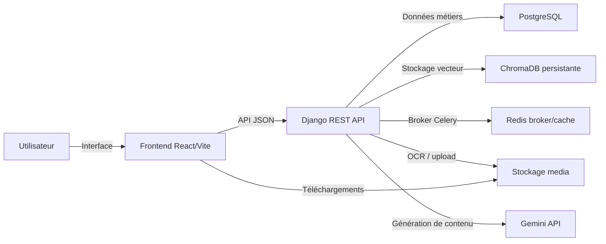
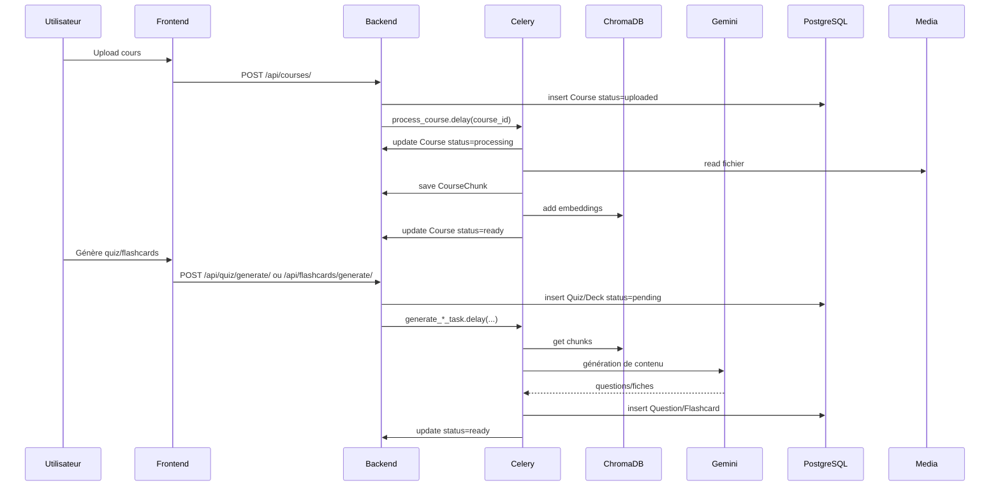

# Cahier des charges — Learnify

## 1. Contexte

Learnify est une plateforme d’apprentissage assistée par IA destinée aux étudiants et aux enseignants. L’utilisateur peut charger des documents pédagogiques (PDF, images), laisser l’application analyser le contenu, puis générer automatiquement des quiz et des flashcards pour mémoriser les notions importantes.

L’application est composée de deux parties principales:
- un backend Django REST Framework chargé des traitements, de l’authentification, du stockage et de l’orchestration des tâches de génération ;
- un frontend React/Vite qui propose une interface utilisateur moderne, responsive et orientée productivité.

## 2. Objectifs

- Proposer un espace sécurisé pour la création de compte et la gestion de profil.
- Autoriser l’import de documents pédagogiques et leur traitement automatique.
- Transformer un cours uploadé en ressources exploitables : quiz et flashcards.
- Permettre la lecture et la révision des contenus générés.
- Offrir une expérience utilisateur fluide, avec retour de statut et traitement en arrière-plan.

## 3. Périmètre fonctionnel

### 3.1 Authentification

- Inscription via formulaire.
- Connexion avec JWT sous `Authorization: Bearer <token>`.
- Gestion des tokens `access` et `refresh` côté frontend.
- Accès sécurisé aux données personnelles et aux ressources de l’utilisateur.

### 3.2 Profil utilisateur

- Consultation et modification des informations du profil.
- Mise à jour du mot de passe avec confirmation.
- Données pré-remplies dans le formulaire de paramétrage.

### 3.3 Gestion des cours

- Upload de fichiers PDF et images (`pdf`, `png`, `jpg`, `jpeg`, `webp`).
- Contrôle de taille maximale configurable (20 Mo par défaut).
- Stockage des fichiers dans `media/courses/<user_id>/`.
- Suivi du statut de traitement : `uploaded`, `processing`, `ready`, `failed`.
- Suppression d’un cours.
- Téléchargement du fichier uploadé depuis l’interface.

### 3.4 Pipeline de traitement des cours

- Extraction de texte des pages PDF via PyMuPDF.
- Détection et OCR des pages scannées avec Tesseract.
- OCR natif pour les fichiers image.
- Découpage adaptatif du texte en chunks selon le type de fichier.
- Enregistrement des chunks en base de données et des embeddings en ChromaDB.
- Passage automatique du statut à `ready` quand le traitement est terminé.

### 3.5 Génération de quiz

- Validation des paramètres de génération (`course_id`, `topic`, `difficulty`, `num_questions`).
- Création immédiate d’un quiz avec statut `pending`.
- Lancement asynchrone d’une tâche Celery pour générer les questions.
- Recherche sémantique dans ChromaDB par sujet si un `topic` est fourni.
- Génération de quiz via Gemini API.
- Stockage des questions et des options en base de données.
- Passage du quiz au statut `ready` lorsque la génération est terminée.

### 3.6 Génération de flashcards

- Validation des paramètres de génération (`course_id`, `topic`, `num_cards`).
- Création immédiate d’un deck avec statut `pending`.
- Lancement asynchrone d’une tâche Celery pour générer les flashcards.
- Recherche sémantique dans ChromaDB pour le sujet si présent.
- Génération de fiches via Gemini API.
- Stockage des fiches en base de données.
- Passage du deck au statut `ready` lorsque la génération est terminée.

### 3.7 Lecture et révision

- Interface de quiz avec navigation par question.
- Enregistrement de la progression de quiz dans `localStorage`.
- Résultats instantanés et possibilité de recommencer.
- Deck de flashcards accessible en lecture et modification du niveau de maîtrise.
- Export des quiz/flashcards en JSON et génération de PDF côté frontend.

### 3.8 Notifications et retours

- Notifications toast pour les actions réussies ou échouées.
- Alerte sur l’avancement des traitements.
- Messages d’erreur clairs sur les uploads ou la génération.

## 4. Architecture technique

### 4.1 Backend

- Framework : Django 6 + Django REST Framework.
- Authentification : `rest_framework_simplejwt` avec `ACCESS_TOKEN_LIFETIME=1h` et `REFRESH_TOKEN_LIFETIME=7j`.
- Base de données : PostgreSQL.
- Stockage de fichiers média : `MEDIA_ROOT` local.
- Tâches asynchrones : Celery avec Redis comme broker.
- Résultats de tâches : `django-db`.
- Cache Redis optionnel avec `CACHE_REDIS_ENABLED=true`.
- Gestion des erreurs : Sentry.
- Base de données d’index vectoriel : ChromaDB persistante dans `chromadb_data`.
- Embeddings : `sentence-transformers` `paraphrase-multilingual-MiniLM-L12-v2`.

### 4.2 Frontend

- Build : Vite.
- Bibliothèques principales : React 19, React Router DOM, TanStack React Query, Zustand, Axios, react-hot-toast, react-dropzone, html2pdf.js.
- Routes protégées via `PrivateRoute`.
- Requêtes API avec gestion automatique du refresh token.
- Polling intelligent : rafraîchissement des listes de quiz et decks en attente.
- UX responsive sur desktop et mobile.

### 4.3 Services et flux métiers

#### 4.3.1 Flux d’upload d’un cours

1. L’utilisateur poste un fichier via `POST /api/courses/`.
2. Le backend crée l’objet `Course` avec `status=uploaded`.
3. Celery exécute `process_course` en arrière-plan.
4. Extraction de texte / OCR.
5. Chunking adaptatif.
6. Insertion des chunks `CourseChunk` en base.
7. Génération et stockage des embeddings ChromaDB.
8. `Course.status` passe à `ready`.

#### 4.3.2 Flux de génération de quiz

1. L’utilisateur demande un quiz via `POST /api/quiz/generate/`.
2. Le backend crée un `Quiz` en base avec `status=pending`.
3. Celery exécute `generate_quiz_task`.
4. Récupération des chunks via ChromaDB.
5. Envoi du prompt à Gemini.
6. Création des `Question`.
7. `Quiz.status` passe à `ready`.

#### 4.3.3 Flux de génération de flashcards

1. L’utilisateur demande un deck via `POST /api/flashcards/generate/`.
2. Le backend crée un `FlashcardDeck` en base avec `status=pending`.
3. Celery exécute `generate_flashcards_task`.
4. Récupération des chunks via ChromaDB.
5. Envoi du prompt à Gemini.
6. Création des `Flashcard`.
7. `FlashcardDeck.status` passe à `ready`.

### 4.4 Données clés

- `CustomUser` : modèle utilisateur personnalisé.
- `Course` : cours uploadé, fichier, type, statut.
- `CourseChunk` : segments de texte associés au cours.
- `Quiz` / `Question` : quiz généré et ses questions.
- `FlashcardDeck` / `Flashcard` : deck de fiches et fiches individuelles.

### 4.5 Sécurité

- Mots de passe validés et hashés par Django.
- Permissions `IsAuthenticated` sur toutes les ressources privées.
- Throttling sur les uploads et la génération de contenu : `5/hour` et `10/day`.
- Filtrage des extensions et taille de fichier à l’upload.
- CORS limité aux origines configurées.
- Sentry pour le monitoring des erreurs.

### 4.6 Déploiement

- Environnement variables : `SECRET_KEY`, `DB_*`, `GEMINI_API_KEY`, `CELERY_BROKER_URL`, `CORS_ALLOWED_ORIGINS`, `CACHE_REDIS_ENABLED`, etc.
- Serveur Django en production avec WSGI/ASGI selon besoin.
- Frontend construit via `npm run build` ou `yarn build`.
- Redis pour Celery et cache de production.
- PostgreSQL pour les données métiers.
- Volume persistant pour `media/` et `chromadb_data`.

### 4.7 Scalabilité et évolutions

- Reprendre la génération dans une file de tâches dédiée.
- Ajouter une API de recherche full-text / sémantique.
- Ajouter un dashboard de suivi de progression et statistiques.
- Autoriser l’import de nouveaux formats (Word, PPT).
- Ajouter OAuth / SSO.
- Gérer des rôles (étudiant, enseignant, admin).

## 5. Diagrammes

### 5.1 Architecture globale

### 5.2 Suite processeur de cours et génération

## 6. Pistes d’amélioration

- Ajouter un workflow de validation des prompts.
- Améliorer le fallback Gemini en cas d’erreur API ou de réponse non JSON.
- Permettre la recherche de cours par mots-clés et par chapitre.
- Ajouter un système de versioning des cours uploadés.
- Déporter ChromaDB vers un service vectoriel externalisé pour scalabilité.
